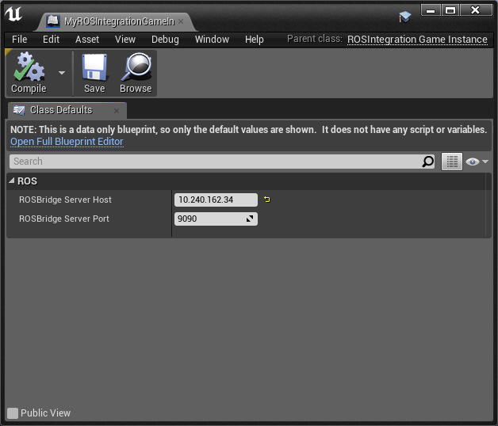
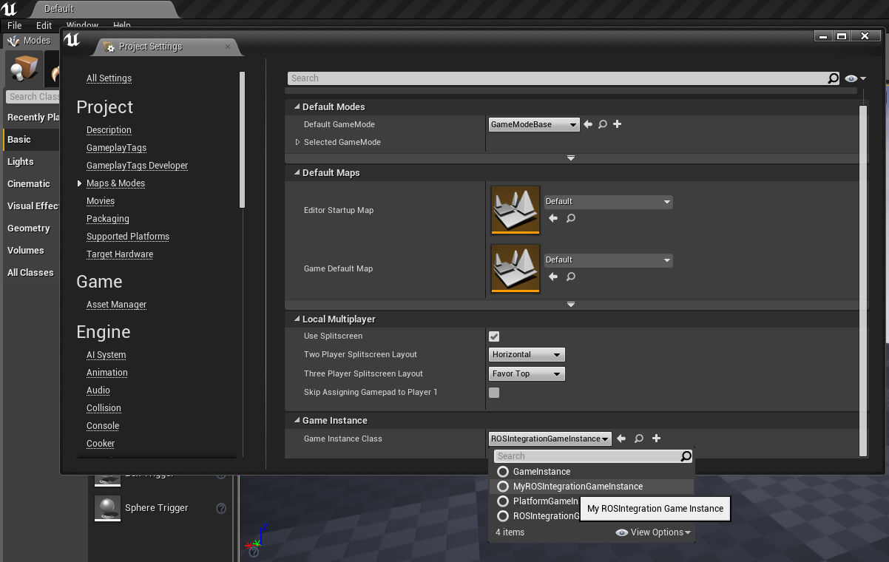

# ROSIntegration Plugin for Unreal Engine 4
This plugin adds ROS support to your Unreal Engine Project. It is designed to be used on different common platforms.
Currently, Windows and Linux are directly supported.

The connection to the ROS world will be accomplished through http://wiki.ros.org/rosbridge_suite and https://github.com/sanic/rosbridge2cpp

## Description

This Plugin contains the basic data structures to enable the user to communicate with a running roscore. 
Currently, ROS Topics and ROS Services are supported.

To boost the performance for big messages (Image Streams for example), this plugin utilizes http://bsonspec.org/ to transfer binary data in a compact manner.

The core communication library behind this plugin is https://github.com/sanic/rosbridge2cpp, which allows the core communication capabilities to be developed, tested and improved by people who are not necessarily using it with Unreal Engine.

ROS Functionality can be added to UObjects or AActors by using functions like Advertise/Subscribe/Publish on the ROS Wrapper classes or in the form specific Unreal ActorComponents.
This currently includes an ActorComponent that can be added to AActors to easily publish their coordinates to TF.
If you need Vision Support in your Unreal Project, you can also add the ROSIntegrationVision Plugin (https://github.com/code-iai/ROSIntegrationVision/) which is compatible with this Plugin.

## Dependencies of this Plugin

This Plugin utilizes BSON to achieve higher transferrates for binary data.
It uses http://mongoc.org/libbson/ to encode and decode the whole ROS communication protocol. 
Since BSON is not included in Unreal Engine (yet), its code has to be added to this plugin. 
Currently, this plugin comes with a pre-compiled libbson for Windows x64 and Linux x64 which doesn't need any additional configuration.

To enable the communcation between Unreal and ROS, you will need a running ROSBridge (https://github.com/RobotWebTools/rosbridge_suite) with bson_mode. Please use rosbridge with version=>0.8.0 to get this feature. After installing rosbridge, you can enable the bson_mode like this:

```
roslaunch rosbridge_server rosbridge_tcp.launch bson_only_mode:=True
```

This plugin has been tested with Unreal Engine versions;

 * 4.18.2

## Usage

### Setting up the plugin

 * Create a new C++ Unreal Project, or open your existing project. Please note that the Plugin might not get compiled automatically in BP-only Projects (see [this Issue](https://github.com/code-iai/ROSIntegration/issues/19)).
 * Add this repository to your `Plugins/` Folder in your Unreal project (copy the folder in so your structure looks like `MyUnrealProject/Plugins/ROSIntegration/ROSIntegration.uplugin`
 * Activate the Plugin in your UE4 project by opening your project and go to Edit -> Plugins. Search for ROSIntegration in the "other" section and activate it.
 * Restart the editor and check that the code for the new plugin is built.
 * To specify your ROSBridge server, you have to create a custom GameInstance that inherits from [`ROSIntegrationGameInstance`](Source/ROSIntegration/Classes/ROSIntegrationGameInstance.h)
  * Find `ROSIntegrationGameInstance` in the Content browser (you might need to enable 'View Options' > 'Show Plugin Content' in the bottom right of the content browser).
  * Right click and create a new C++ or Blueprint class based on `ROSIntegrationGameInstance`
    
    

  * Open your new C++ class / Blueprint object and change the values of `ROSBridgeSeverHost` and `ROSBridgeServerPort`
    
    
    
  * Open Project Settings > Maps and Modes, and set the GameInstance to match **your new GameInstance object**, not `ROSIntegrationGameInstance`
    
    
   
 * Don't forget to save everything (Ctrl + Shift + S)
 * In some cases (for example on Linux), it might be necessary to call the Generate Project Files action on UE4 in order to fetch the new header files for the plugin.

### C++ Topic Publish Example
To get started, you can create a new C++ Actor and let it publish a message once at the BeginPlay Event.
Add the following code into the BeginPlay() method of any actor that is put into to your world to see if the connection to ROS works:

```c++
#include "ROSIntegration/Classes/RI/Topic.h"
#include "ROSIntegration/Classes/ROSIntegrationGameInstance.h"
#include "ROSIntegration/Public/std_msgs/String.h"

// Initialize a topic
UTopic *ExampleTopic = NewObject<UTopic>(UTopic::StaticClass());
UROSIntegrationGameInstance* rosinst = Cast<UROSIntegrationGameInstance>(GetGameInstance());
ExampleTopic->Init(rosinst->_Ric, TEXT("/example_topic"), TEXT("std_msgs/String"));

// (Optional) Advertise the topic
// Currently unimplemented in the plugin
//ExamplePublishTopic->Advertise();

// Publish a string to the topic
TSharedPtr<ROSMessages::std_msgs::String> StringMessage(new ROSMessages::std_msgs::String("This is an example"));
ExampleTopic->Publish(StringMessage);
```

### C++ Topic Subscribe Example

```c++
#include "ROSIntegration/Classes/RI/Topic.h"
#include "ROSIntegration/Classes/ROSIntegrationGameInstance.h"
#include "ROSIntegration/Public/std_msgs/String.h"

// Initialize a topic
UTopic *ExampleTopic = NewObject<UTopic>(UTopic::StaticClass());
UROSIntegrationGameInstance* rosinst = Cast<UROSIntegrationGameInstance>(GetGameInstance());
ExampleTopic->Init(rosinst->_Ric, TEXT("/example_topic"), TEXT("std_msgs/String"));

// Create a std::function callback object
std::function<void(TSharedPtr<FROSBaseMsg>)> SubscribeCallback = [](TSharedPtr<FROSBaseMsg> msg) -> void 
{
    auto Concrete = StaticCastSharedPtr<ROSMessages::std_msgs::String>(msg);
    if (Concrete.IsValid())
    {
        UE_LOG(LogTemp, Log, TEXT("Incoming string was: %s"), (*(Concrete->_Data)));
    }
    return;
};

// Subscribe to the topic
ExampleTopic->Subscribe(SubscribeCallback);
```

### C++ Service Request example

TODO

### Supported Message Types

Topic Message Type                 | ROS to UE4 | UE4 to ROS
---------------------------------- | ---------- | ----------
std_msgs/Header                    | ✓          | ✓
std_msgs/String                    | ✓          | ✓
tf2_msgs/TFMessage                 | ✘          | ✓
geometry_msgs/Quaternion           | ✘          | ✓
geometry_msgs/Transform            | ✘          | ✓
geometry_msgs/TransformStamped     | ✘          | ✓
geometry_msgs/Vector3              | ✘          | ✓
sensor_msgs/CameraInfo             | ✘          | ✓
sensor_msgs/Image                  | ✘          | ✓
sensor_msgs/RegionOfInterest       | ✘          | ✘


Service Message Type               | ROS to UE4 | UE4 to ROS
---------------------------------- | ---------- | ----------
rospy_tutorials/AddTwoIntsRequest  | ✓          | ✓
rospy_tutorials/AddTwoIntsResponse | ✓          | ✓
